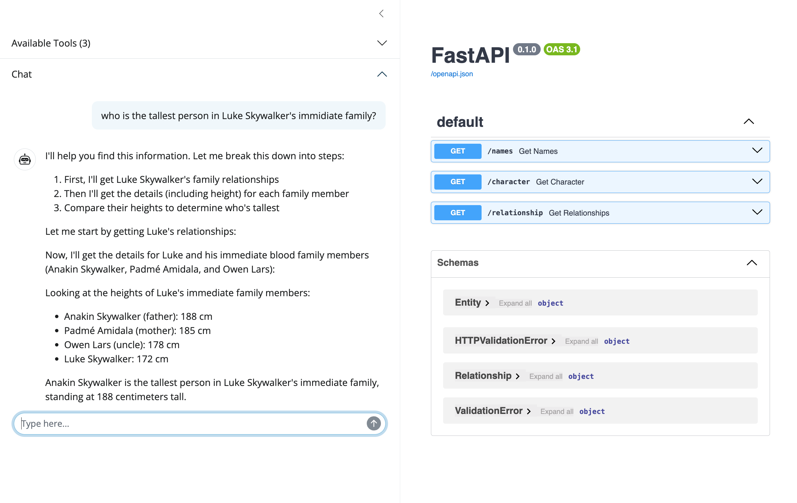

# MCP

A simple example of a client and server using the Connect API.

## Usage

Run an MCP server:

```bash
CONNECT_API_KEY="<your key>" SWAGGER_FILE="swagger.yaml" make server
```

Then run the MCP client:

```bash
make client
```

Modify the chat in the main function of `app.py` to ask different questions.


## Swagger Usage


The code below is a snippet of how to register Swagger tools with Chatlas.

```python
import chatlas
import requests
from openapi_mcp.chatlas import SwaggerTool
from openapi_mcp.connect_api import map_operations_to_tools
from openapi_mcp.swagger import (
    expand_all_references,
    transform_swagger_to_operation_dict,
)

api_url = "127.0.0.1:8000/"
openapi_dict = requests.get(f"{api_url}/swagger.json").json()

openapi_doc = expand_all_references(openapi_dict)
operations = transform_swagger_to_operation_dict(openapi_doc)
tools = map_operations_to_tools(operations)

aws_model = os.getenv("AWS_MODEL", "us.anthropic.claude-3-5-sonnet-20241022-v2:0")
aws_region = os.getenv("AWS_REGION", "us-east-1")
chat = chatlas.ChatBedrockAnthropic(model=aws_model, aws_region=aws_region)
for operation in api_operations.values():
    SwaggerTool.register_tool(
        chat,
        SwaggerTool(
            base_url=api_url,
            operation=operation,
        ),
    )
```

To see this in action, run a local OpenAPI-compatible server and run the Shiny application:

```bash
# Run the OpenAPI-compatible server
make ex-starwars
```

```bash
# Run Shiny
make shiny
```



<!-- ## Tasks -->
<!--  -->
<!-- - [x] Read swagger file -->
<!-- - [x] Expand swagger file reference objects: `doc = expand_swagger(doc) -->
<!-- - [x] Create bridge between swagger file and tool call: ` -->
<!-- - [x] Register tool calls with chatlas -->
<!-- - [x] Make function to process generic swagger file: `operations = transform_swagger_to_operation_dict(doc)` -->
<!-- - [x] Move all of `mcp_servers` into `openapi_mcp` as methods -->
<!-- - [x] Make shiny chat app -->
  <!-- - [x] Accepts a plumber API URL -->
  <!-- - [x] Swagger docs in the main page -->
  <!-- - [x] Leverage new function -->
<!-- - [x] Make into package? -->
  <!-- - [x] Export functions that accept a swagger information and return tool calls (see usage above) -->
